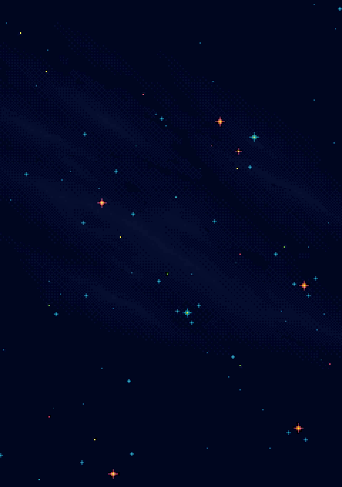
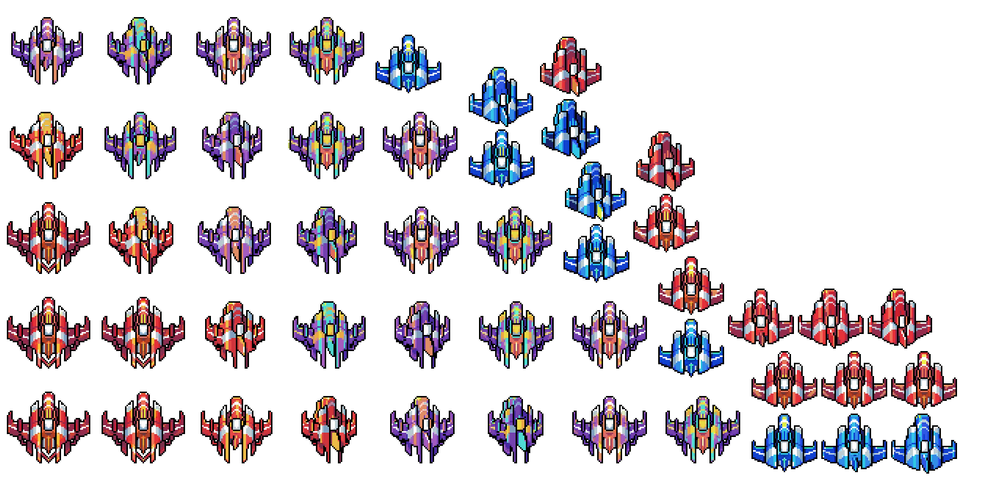
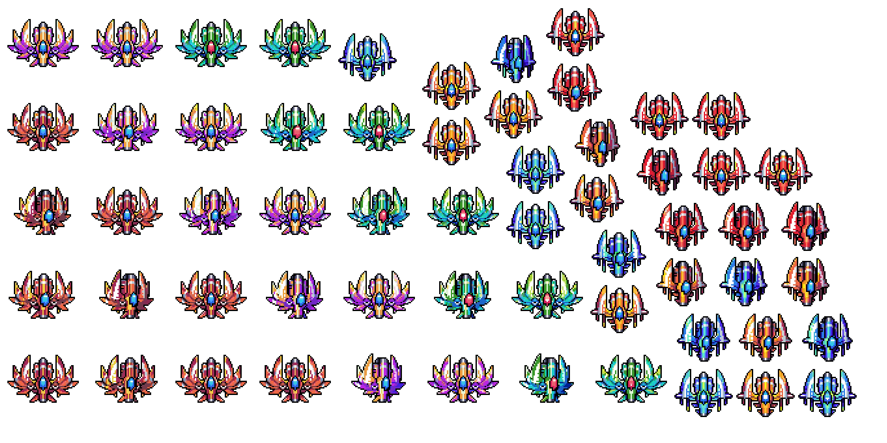
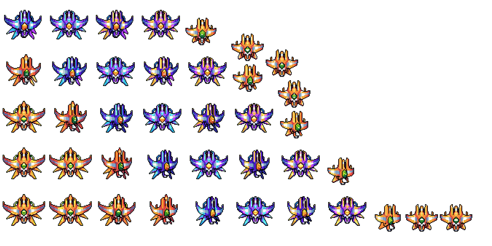
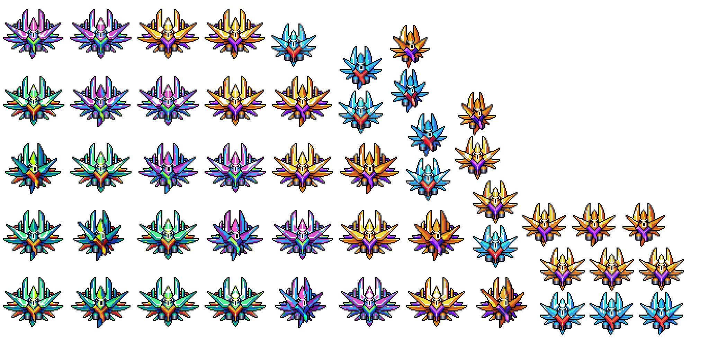
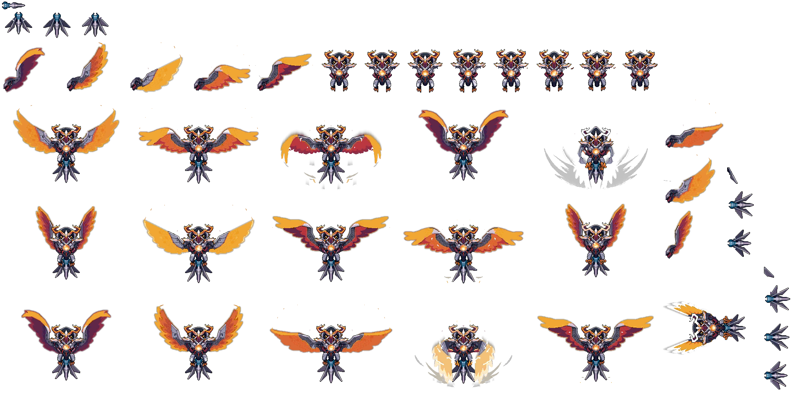
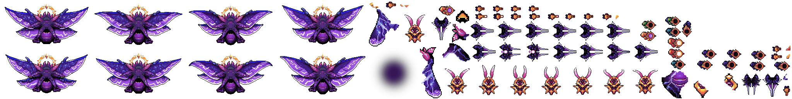
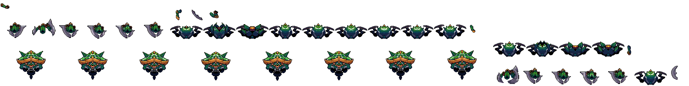
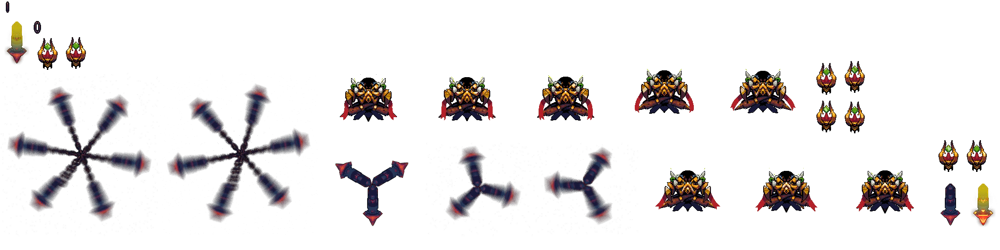

# Galaxiga

> A 2D vertical space shooter (shoot 'em up) built with Unity 6, featuring 70+ levels, multiple boss encounters, an endless survival mode, and a full mobile monetization stack.

[](https://unity.com/)
[](https://play.google.com/)
[](./Galaxiga/ProjectSettings/ProjectSettings.asset)
[](./LICENSE)
[](https://hoatv2211.github.io/Share004_Galaxiga/)

<p align="center">
  <a href="https://hoatv2211.github.io/Share004_Galaxiga/">
    
  </a>
  <br/><em>Click to play the WebGL demo</em>
</p>

---

## Overview

Galaxiga is a mobile space-shooter where the player pilots a spacecraft, defeats waves of enemies, and confronts multi-phase bosses across a campaign of 70+ handcrafted levels. The game is structured around the **SkyGameKit** framework — a custom gameplay layer built on top of Unity that provides a wave/turn/enemy pipeline, an abstract player component system, and an object-pooling backbone.

---

## Project Structure

```
Share004_Galaxiga/
├── Galaxiga/                   # Unity project root
│   ├── Assets/
│   │   ├── Game/               # Scene files organized by mode
│   │   │   ├── _Scenes/        # Core scenes (Home, Intro, Loading, SelectLevel…)
│   │   │   ├── LevelScene/     # Regular campaign levels (Level6 – Level70)
│   │   │   ├── Scenes_BossMode/# Boss encounters (Level10, 15, 20, LevelBoss1–14)
│   │   │   └── Prefab/Scenes/  # Endless mode + tutorial levels (Level1–5)
│   │   ├── Scripts/
│   │   │   ├── SkyGameKit/     # Core gameplay framework (see Architecture below)
│   │   │   ├── SgLib/          # Utility extensions (Color, DateTime, File, Enums)
│   │   │   ├── DG/             # DOTween animation helpers
│   │   │   ├── Spine/          # Spine runtime (skeletal animation)
│   │   │   ├── I2/             # I2 Localization (multilingual support)
│   │   │   ├── SRDebugger/     # In-game runtime debug console
│   │   │   ├── MoreMountains/  # Feel framework (game-feel feedbacks)
│   │   │   ├── FalconSDK/      # Cross-promotion system
│   │   │   ├── OneSignalPush/  # Push notifications
│   │   │   ├── Coffee/         # UI effects (ShinyEffect, UIParticle)
│   │   │   ├── SWS/            # Simple Waypoint System (enemy paths)
│   │   │   └── …               # Other third-party plugin scripts
│   │   ├── Prefab/             # Enemy, player, FX prefabs
│   │   ├── Sprites/            # 2D art assets
│   │   ├── Sounds/             # Audio clips
│   │   ├── Shaders/            # Custom shaders
│   │   └── Plugins/            # Native DLLs (DOTween, Odin, GUIAnimator…)
│   ├── Packages/               # Unity Package Manager manifest
│   └── ProjectSettings/        # Build & quality settings
```

---

## Game Modes

| Mode | Description | Scene(s) |
|------|-------------|----------|
| **Campaign** | 70+ handcrafted levels in sequential order | `Level6` – `Level70` |
| **Tutorial** | First-run introductory stages | `Level1` – `Level5` (Level_Fix_Feeling) |
| **Boss Mode** | Dedicated boss encounters every 5 levels | `LevelBoss1` – `LevelBoss14`, `Level10/15/20` |
| **Endless** | Survival with escalating difficulty | `LevelEndless` |

---

## Playable Ships

The game ships multiple upgradeable fighter classes. Each `Aircraft*.png` sprite sheet contains all animation frames and color variants for one ship family.

<p align="center">
  
  <br/><em>Fighter ships – Class 2 (upgrade color variants &amp; size tiers)</em>
</p>

<p align="center">
  
  <br/><em>Fighter ships – Class 3</em>
</p>

<p align="center">
  
  <br/><em>Fighter ships – Class 7</em>
</p>

---

## Enemy & Boss Gallery

Regular enemies (`Aircraft5`, `Aircraft7` sprite sheets) fly in formation waves defined by the SkyGameKit wave pipeline. Boss encounters appear at every 5th level milestone.

### Regular Enemies

<p align="center">
  
  <br/><em>Enemy formation units — crystal spike class</em>
</p>

### Bosses

<p align="center">
  
  <br/><em>Eagle Mechanic Boss — multi-phase winged guardian</em>
</p>

<p align="center">
  
  <br/><em>Moth Boss — purple cosmic butterfly, spreads multi-directional bullets</em>
</p>

<p align="center">
  
  <br/><em>Crab Boss — armored green crustacean with claw projectiles</em>
</p>

<p align="center">
  
  <br/><em>Star Boss — rotary blade spinner with mini-minion spawns</em>
</p>

---

## Architecture: SkyGameKit Framework

All gameplay logic lives in the `SkyGameKit` namespace (`Assets/Scripts/SkyGameKit/`).

### Wave Pipeline

```
LevelManager
  └── SequenceWave / PointWave / FreeWave   (3 wave types)
        └── WaveManager
              └── TurnManager[]             (one turn = one enemy group)
                    └── BaseEnemy[]         (spawned from EnemyPool)
```

| Class | Responsibility |
|-------|---------------|
| `LevelManager` | Singleton; tracks score, `LevelState`, alive enemies, killed enemies, and sequences all waves |
| `SequenceWave` | Waves that execute one after another in order |
| `PointWave` | Waves triggered by a score threshold or spatial point |
| `FreeWave` | Continuous spawning; not bound to a turn sequence |
| `WaveManager` | Abstract base; manages turn lifecycle (`NotStarted → Warning → Running → Stopped`) |
| `TurnManager` | Controls a group of enemies within a wave; handles timed entry |
| `BaseEnemy` | HP, state machine (`InPool / Alive / Dead / Removed`), pool-based recycling |

### Player Component System

The player is composed of four **abstract** component types so concrete implementations can be swapped per level or ship variant:

| Abstract | Concrete | Responsibility |
|----------|----------|----------------|
| `APlayerMove` | `SgkPlayerController` | Touch/mouse drag movement clamped to camera bounds |
| `APlayerAttack` | `SgkPlayerAttack` | Delegates firing to `UbhShotCtrl` (Unity Bullet Hell) |
| `APlayerHealth` | `SgkPlayerHealth` | HP, collision detection with `Enemy` / `EnemyBullet` tags |
| `APlayerState` | `SgkPlayerState` | Tracks alive/dead/invincible states |

**`SkyGameKit.QuickAccess.Player`** provides static global access to these components via tag lookup (`"Player"`) — no cross-scene references needed.

### Wingman System

`SgkWingman` follows the player with a configurable `wingmanSpeed`, offset slightly below the ship — attach to any companion prefab.

### Object Pooling

Three named pools managed by **PathologicalGames PoolManager**:

| Pool Name | Used For |
|-----------|----------|
| `EnemyPool` | All enemy prefabs |
| `ExplosionPool` | VFX explosions |
| `BulletPool` | Player & enemy bullets (via UBH) |

Access pool transforms via `Const.EnemyPoolTransform` / `Const.ExplosionPoolTransform`.

### ID Scheme (for debugging)

```
SequenceWave ID = 1_000_000 × (waveIndex + 1)
PointWave ID    = 1_000_000 × (500 + waveIndex + 1)
Turn ID         = WaveID + 1_000 × (turnIndex + 1)
Enemy ID        = TurnID + (enemyIndex + 1)
Player ID       = 1_000_000_000 + (playerIndex + 1)
```

---

## Third-Party Dependencies

### Included in `Assets/` (Asset Store / custom)

| Package | Version / Source | Purpose |
|---------|-----------------|---------|
| **DOTween Pro** | DG namespace | Tweening & sequence animations |
| **Odin Inspector** (Sirenix) | Plugins/Sirenix | Editor tooling, `[ShowInInspector]`, `[DisplayAsString]` |
| **Spine** | Runtime in Scripts/Spine | Skeletal animation for planes and bosses |
| **MoreMountains Feel** | Scripts/MoreMountains | Haptic, audio, and screen-shake feedbacks |
| **PathologicalGames PoolManager** | Embedded | Object pooling (`PoolManager.Pools["…"]`) |
| **SWS** (Simple Waypoint System) | Scripts/SWS | Spline-based enemy movement paths |
| **UBH** (Unity Bullet Hell) | Embedded | Bullet pattern system (`UbhShotCtrl`, `UbhBullet`) |
| **2D Laser Pack** | Scripts/TwoDLaserPack | Laser beam rendering |
| **SRDebugger** | Scripts/SRDebugger | In-game debug/console panel |
| **I2 Localization** | Scripts/I2 | Multi-language string management |
| **Coffee UI Extensions** | Scripts/Coffee | Shiny effect & UI particle |
| **Super Scroll View** | Scripts/SuperScrollView | High-performance recycled scroll lists |
| **Snap Scroll View** | Scripts/SnapScrollView | Paged/snapping scroll carousels |
| **FalconSDK** | Scripts/FalconSDK | Cross-promotion between studio titles |
| **OneSignal** | Scripts/OneSignalPush | Push notification campaigns |
| **DentedPixel LeanTween** | Scripts/DentedPixel | Lightweight tween alternative |

### Unity Package Manager (`Packages/manifest.json`)

| Package | Version | Purpose |
|---------|---------|---------|
| `com.unity.ads` | 4.16.4 | Unity Ads (interstitials, rewarded) |
| `com.unity.purchasing` | 4.14.2 | In-App Purchases (IAP) |
| `com.unity.timeline` | 1.8.10 | Cinematic cut-scenes / intro sequences |
| `com.unity.ugui` | 2.0.0 | uGUI canvas & UI system |
| `com.unity.2d.sprite` | 1.0.0 | 2D sprite rendering |
| `com.unity.2d.tilemap` | 1.0.0 | Tilemap support |
| `com.unity.ai.navigation` | 2.0.10 | NavMesh (used for ground-path enemies) |
| `com.unity.test-framework` | 1.6.0 | Automated tests |

---

## Scene Flow

```
Intro
  └─► LoadingFirstGame
        └─► Home
              ├─► SelectLevel
              │     └─► Loading ─► Level (N)
              │                      ├─ Boss checkpoint ─► LevelBoss (N)
              │                      └─ LevelEndless
              └─► LevelTry    (quick-try / replay flow)
```

---

## Opening the Project

**Prerequisites**

- Unity **6000.3.10f1** — install via [Unity Hub](https://unity.com/download)
- Android Build Support module (for Android builds)
- iOS Build Support module (for iOS builds, macOS only)

**Steps**

1. Clone or unzip the repository.
2. Open **Unity Hub** → **Open** → select the `Galaxiga/` folder.
3. Wait for Unity to import assets and compile scripts (first open takes several minutes).
4. Open `Assets/Game/_Scenes/Home.unity` to start from the main menu, or open any `LevelScene/Level*.unity` directly to test a specific level.

---

## Building

### Android

1. **File → Build Settings** → select **Android**.
2. Ensure **Player Settings** → **Other Settings**:
   - `Bundle Identifier` matches your keystore
   - `Target Architectures`: ARMv7 + ARM64 (already set)
3. Assign your keystore in **Player Settings → Publishing Settings**.
4. Click **Build** or **Build and Run**.

### iOS

1. **File → Build Settings** → select **iOS** → **Switch Platform**.
2. Click **Build** to export an Xcode project.
3. Open the exported `.xcodeproj` in Xcode, configure signing, and archive.

---

## Key Conventions

- **Singleton access**: Use `SgkSingleton<T>.instance` for gameplay singletons (e.g., `LevelManager.instance`).
- **Player access**: Use `SkyGameKit.QuickAccess.Player.Health`, `.Move`, etc. — never `FindObjectOfType` at runtime.
- **Enemy spawning**: Always spawn from `EnemyPool`; call `BaseEnemy.Restart()` instead of `Instantiate`.
- **Wave authoring**: Add a `SequenceWave` component to a Scene GameObject, then nest `TurnManager` children under it. `LevelManager` auto-discovers them via `AddSequenceWave` / `AddPointWave`.
- **Tags**: `"Player"`, `"Enemy"`, `"EnemyBullet"` — required by collision logic in `SgkPlayerHealth` and `BaseEnemy`.
- **Odin Inspector**: Use `[ShowInInspector]` and `[DisplayAsString]` on runtime properties to inspect live state in the Editor without Play-mode recompilation.
- **DOTween**: Initialize via `DOTween.Init()` in a bootstrap scene; do not call from `Awake` in gameplay scripts.

---

## Monetization

| Channel | Implementation |
|---------|---------------|
| Interstitial / Rewarded Ads | Unity Ads (`com.unity.ads` 4.16.4) |
| In-App Purchases | Unity IAP (`com.unity.purchasing` 4.14.2) |
| Cross-Promotion | FalconSDK (`Assets/Scripts/FalconSDK/CrossPromotion/`) |
| Push Re-engagement | OneSignal (`Assets/Scripts/OneSignalPush/`) |

---

## License

See [LICENSE](./LICENSE) for details.
